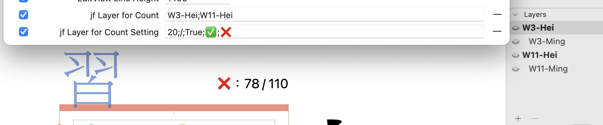
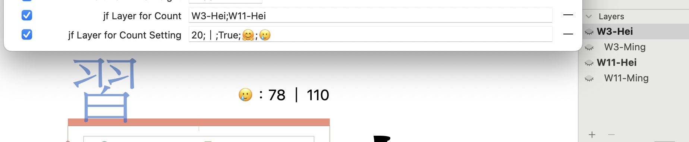

# jf Show Node Count

A [Glyphs.app](https://glyphsapp.com/) plugin to display the number of nodes between multiple layers/masters for checking compatibility.

An Chinese version is contained below.

## Install

1. Download `jfShowNodeCount.glyphsReporter` and open via Glyphs.
2. Restart Glyphs (cmd+Q).
3. Add parameters in *File > Font Info > Font > Custom Parameter*.
4. Toggle *View > jf Node Count*.

## Custom Parameter

- `jf Layer for Count` (*required*)：The layer/master names, separated by a semicolon.
  - E.g., `Regular; Medium; Bold`.
  - Use `::` operator to connect parent layer name and child layer name to specific layer if there has the same name.
    - E.g., `Light::Ref;Bold::Ref`.
  - If you have interpolate sublayer, concat the master name and interpolate sublayer name with a blank. Noticed that Glyphs using `‹` rather than using `<`.
    - E.g., `Light [500‹wg];Bold [500‹wg] `
- `jf Layer for Count Setting` (*optional*)：Display setting.
  - Default: `20;/;True;✅;❌`, separated by a semicolon.
  - val 1: Font size
      - Default: `20`.
  - val 2: Style of the delimiter
      - Default: `/`.
  - val 3: Whether to show the emoji/sign when the layers have the same number of nodes or not.
      - Default: `True`. Keep it clear if you don't need it.
  - val 4: When the layers have the same number of nodes.
      - Default: `✅`. Keep it clear if you don't need it.
  - val 5: When the layers do not have the same number of nodes.
      - Default: `❌`. Keep it clear if you don't need it.

## Example

- Do not show the emoji: `20;/;;;`.
- Use "|" as the delimiter: `20;｜;True;✅;❌`.
- Larger font size: `50;/;True;✅;❌`.
- Show "Perfect!" when layers have the same number of nodes: `20;/;True;Perfect!;❌`.
- ...and so on!

## Environment

The plugin works in Glyphs 3.1 (3133) in macOS Monterey (12.6) with Python 3.9.1. I've only tested it in the current environment, and perhaps it works on earlier or later versions too.

***

# jf Show Node Count

用來顯示多個圖層 / 主板之間的總節點數，用來對主板之間的相容性。

## 安裝

1. 下載 `jfShowNodeCount.glyphsReporter` ，並以 Glyphs 開啟.
2. 重新啟動 Glyphs （cmd+Q）.
3. 於 *File > Font Info > Font > Custom Parameter* 中自行添加參數.
4. 於 *View > jf Node Count* 啟用.

## Custom Parameter

- `jf Layer for Count`：要比較的圖層名稱，以半形分號區別
  - 當不同主板間有相同的圖層名稱時，可以使用 `::` 運算符串接子父圖層的名字，以用來指定某圖層
    - E.g., `Light::Ref;Bold::Ref`。
  - 會用到方括號插值的場合，請再主板跟圖層名稱間空一格，且小於使用「‹」而非「<」。
    - E.g., `Light [500‹wg];Bold [500‹wg] `
- `jf Layer for Count Setting`：顯示的設定，共五個值，預設為 `20;/;True;✅;❌` ，以半形分號分隔設定值
	- 字體大小，預設為 `20`
    - 分隔號的樣式，預設為 `/`
    - 當比較的圖層們總節點數相同時，是否顯示標記，預設為`True`，若不顯示留空
    - 當比較的圖層們總節點數「相同時」顯示的標記，預設為 `✅`。
      - 不顯示時留空
    - 當比較的圖層們總節點數「不相同時」顯示的標記，預設為 `❌`。
      - 不顯示時留空

## 範例

- 不想顯示相同與否的標記：「20;/;;;」
- 想改用「｜」作為分隔線：「20;｜;True;✅;❌」
- 字想更大：「50;/;True;✅;❌」

## 測試環境

- Glyphs App version: Glyphs 3.1 (3133)
- macOS version: macOS Monterey (12.6)
- Python version: Python 3.9.1