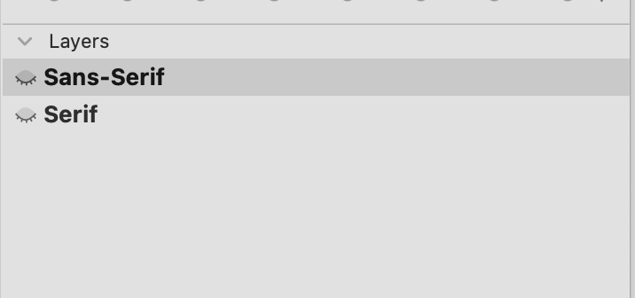
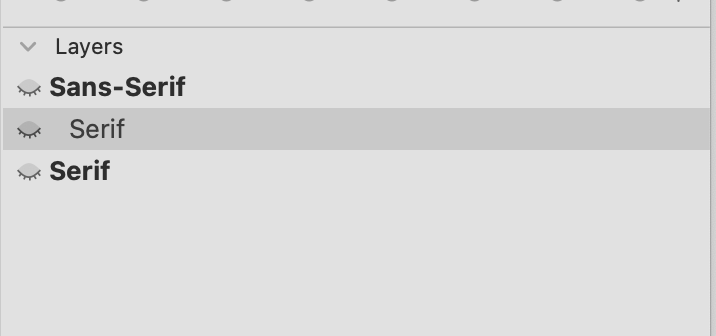
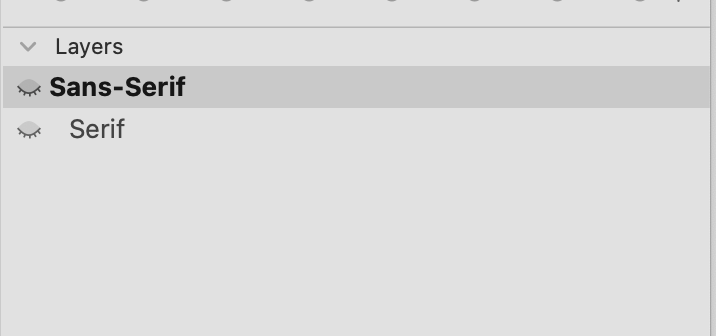
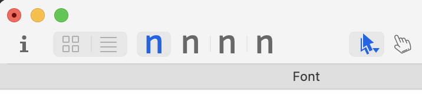
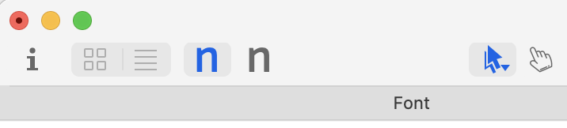

# Append To Sublayer

A [Glyphs.app](https://glyphsapp.com/) script to copy a layer/master to another master, making the former as a the latter's sublayer.

Sometimes we need a reference layer from other master, however, we don't need the whole master at all.

An Chinese version is contained below.

## How to Use

For example, we want to let `X Master` become `Y Master`'s sublayer, named `Z Sublayer`.

### Setting

- `ATTACH_LAYER_ID`: `Y Master`'s Layer ID (should be only).
- `TO_BE_SUBLAYER_LAYER_ID`: `X Master` Master ID (should be only).
- `NEW_SUBLAYER_NAME`: `Z Sublayer` name (customized).

You can find the layer id via Micro Panel:

```
print(Glyphs.font.selectedLayers[0].layerId)
```


### Steps

1. Check *File > Font Info > Masters* has at least two master, find the both masters' id.
1. Open *Window > Macro Panel*.
1. Paste the code.
2. Click Run.
3. Remove the useless master.

## Example

|1|2|3|
|:---:|:---:|:---:|
||||
|Before|After running the code|Remove useless master (here, `Serif`)|


## Why you need this?

- For setting instances and interpolating easily.
- Reduce the file size.
- Making the panel-less icon banner.

|Before|After|
|:---:|:---:|
|||

***

# Append To Sublayer

複製某一個主板到另一個主板中，使前者成為後者的子圖層。

有時候我們需要參考某一套字體的主板字體，然而我們有時候其實不需要整個主板，只需要把它當作子圖層就好。

## 使用方法

舉例來說，我們想讓主板 `X Master` 成為 `Y Master` 主板之下的子圖層，名為 `Z Sublayer`。

### 設定

- `ATTACH_LAYER_ID`: `Y Master` 的 Layer ID （唯一）。
- `TO_BE_SUBLAYER_LAYER_ID`: `X Master` 的 Master ID（唯一）。
- `NEW_SUBLAYER_NAME`: `Z Sublayer` 名稱 (自定義)。


可以透過以下方法找到主板的 id:

```
print(Glyphs.font.selectedLayers[0].layerId)
```

### Steps

1. 檢查 *File > Font Info > Masters* 至少有兩個主板，並查找兩個主板的 ID。
2. 打開 *Window > Macro Panel*。
3. 依照上方步驟修改程式碼後貼入。
4. 戳 Run。
5. 移除不需要的主板。

## 範例

|1|2|3|
|:---:|:---:|:---:|
||||
|原本|執行完後|再移除不需要的主板|


## 為啥需要這個

- 更好生成主體和插值（不然要另外設定不啟用主板之類的功能）。
- 只複製完稿的圖層，會忽視主板下的歷史圖層，有效降低檔案大小。
- 減少讓最上層的最左邊的 icon 數目，看起來更清爽。

|Before|After|
|:---:|:---:|
|||
