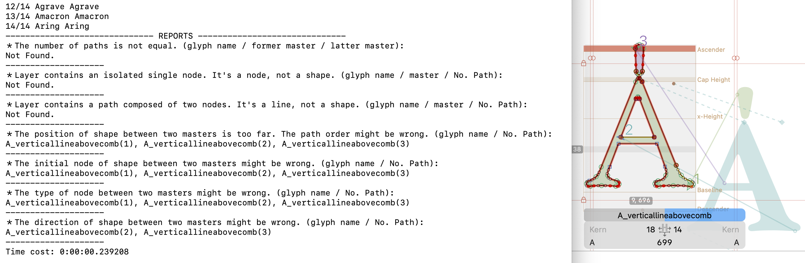
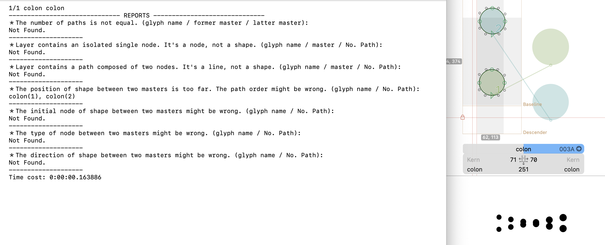
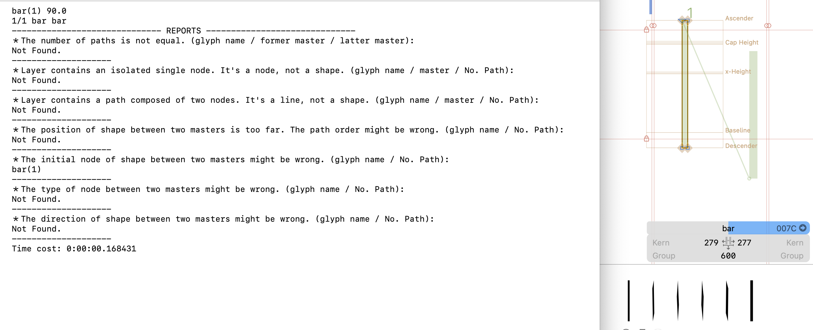

# Glyph Compatibility Reporter

A [Glyphs.app](https://glyphsapp.com/) script to check the compatibility for interpolating between two master, and print the report of problem glyphs.

An Chinese version is contained below.

## How to Use

1. Open *Window > Macro Panel*
2. Paste the code.
3. Select the glyphs you want to check on glyphs panel. (cmd+A for all)
4. Click Run

## Custom Setting

In the code, there are some custom value.

- `POSITION_TOLERATE`
  - To check the shape between two masters has similar position, you can set a tolerate value. Default value is `100`. Unit: em.
  - Avoid shapeshifters, e.g., `: (colon)`.
  - 

- `ANGLE_TOLERATE`: 
  - To check the initial point has correct direction and order. Default value is `45`. Unit: degree.
  - It will check the vector angle between the last node (a.k.a. initial node) and the first node.
  - Avoid shapeshifters, e.g., `| (bar)`.
  - 

- `open_flag`: 
  - If `1`, open the new tab in edit view with problem glyphs after the result.
  - You can still read the report in Macro Panel console if you set it to `0`.

- `former_master_name` and `latter_master_name`:
  - String, the name of masters you want to compare.
  - Default value is the first master and the second master. If you have multiple master, you can set it as master's name.]
  
## Environment

The plugin works in Glyphs 3.1 (3133) in macOS Monterey (12.6) with Python 3.9.1. I've only tested it in current environment, and perhaps it works on earlier or later versions too.

*** 

# Glyph Compatibility Reporter

檢查選取字符間的相容性問題。

## 使用方法

1. 打開 *Window > Macro Panel*
2. 貼上程式碼
3. 選取你要檢查的字符（全選 cmd+A）
4. 按 Run

## Custom Setting

在程式碼的最上面，有以下幾個值可供自定義。

- `POSITION_TOLERATE`
  - 可容忍的距離差距
  - 同樣的路徑在不同主板之間應該會在相對接近的位置，若無，則路徑順序可能有誤。常見的如「灬」字中右邊三點、「：」的兩點，雖然節點和屬性皆相同，但若路徑順序錯置，在插值時仍可以成功插出，但實際上會出現問題。預設值為 `100`，單位為 em.
  - 避免這種情況（相同形狀的路徑，位置錯置）：
  - 

- `ANGLE_TOLERATE`: 
  - 可容忍的角度差異
  - 檢查路徑中的起始點角度是否接近。預設為 `45`，單位為度。
  - 雖然稱之為「起始點」，但其實路徑中的箭頭節點在資料結構中是最後一個節點（list[-1]），箭頭的下一個節點才是真正的第 0 個節點（list[0]）。
  - 避免這種情況（相同形狀的路徑，起始點錯置）：
  - 

- `open_flag`: 
  - `1`：在新的分頁開啟可能會有問題的字符。
  - 但即使設為 `0`，一樣可以在 Macro Panel 中看到結果。

- `former_master_name` 及 `latter_master_name`:
  - 預設比對的是第一個和第二個主板，但若你有兩個主板以上，可以在這裡直接指定主板名字。
  

## 測試環境

- Glyphs App version: Glyphs 3.1 (3133)
- macOS version: macOS Monterey (12.6)
- Python version: Python 3.9.1