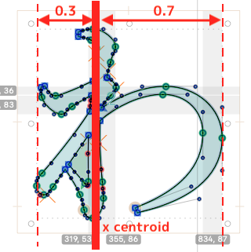
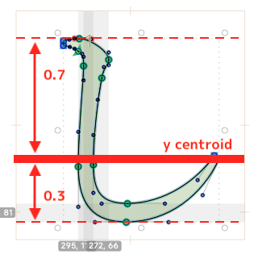
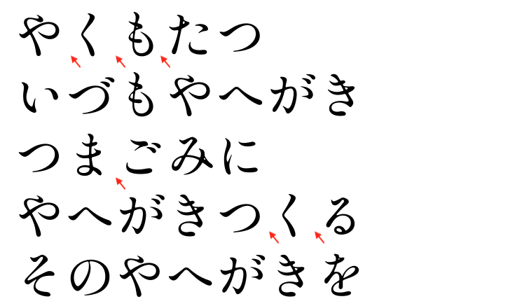
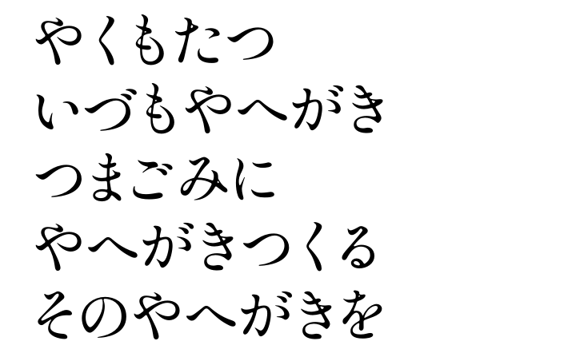
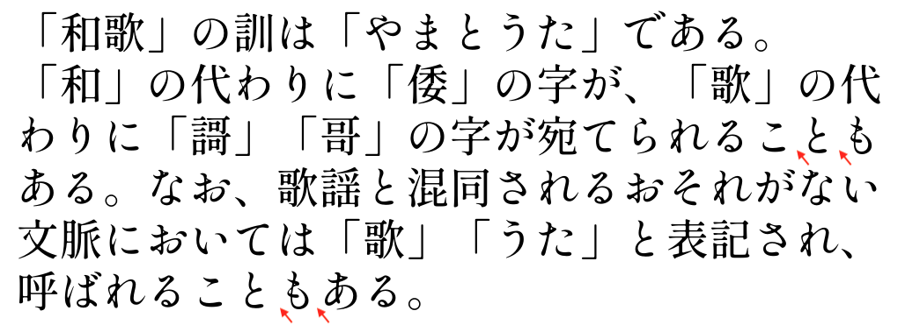
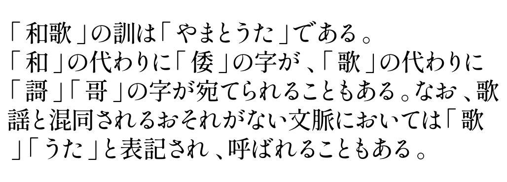

# Monospaced to Proportional Font

A [Glyphs.app](https://glyphsapp.com/) script to make a monospaced font into proportional font based on mathmatical method.

## How to Use

1. Open *Window > Macro Panel*.
2. Paste the code.
    - `analysis.py`: To keep the width/height data into a temporary file.
    - `implement.py`: To adjust the proportional-ize procedure.
3. Select the glyphs you want to transform. (cmd+A for all)
4. Click Run.

## Custom Setting

The code contains some custom values:

- `EXP_DECAY_ALL_WIDTHS_FACTOR` ($\alpha>0$): A factor to adjust the $\gamma$. When $\alpha$ comes smaller, the result kerning becomes smaller.
- `EXP_DACAY_PROP_FACTOR` ($\beta$)
- `BASE_KERN` ($\kappa>0$)
- `MIN_WIDTH` / `MIN_HEIGHT` ($\min_{k}$): The minimum of width/height of each glyph. If the result is less than this value, it will turn to this value.
- `MAX_WIDTH` / `MAX_HEIGHT` ($\max_{k}$): The maximum of width/height of each glyph. If the result is more than this value, it will turn to this value.

You should try different value to test the best display effect.

## Algorithm

### 1. Calculate percentile rank of width/height per each glyph

If there have $N$ unique layer widths/heights, calculate percentile rank ($R$) in all widths/heights for each width/height:

$$
R = \frac{rank}{N} \in (0,1]
$$

For example, we have six glyphs with six layer widths/heights with $[15, 10, 14, 20, 20, 20]$, the percentile rank of first glyph should be $0.75$, meaning it is the top **3rd of 4** unique element ($\text{set}[10,14,15,20]$).

### 2. Calculate exponential decay rate of all widths/heights

Use $R$ to get a exponential decay rate of all widths/heights ($\gamma$).

$$
\gamma = \exp(-R/\alpha)
$$

, where $\alpha\in\mathbf{R}$ is a decay factor and $-R/\alpha<0$.

### 3. Calculate the centroid proportion for each glyph

For each glyph, we can calculate the proportion of centroid to top and centroid to bottom, based on the geometric mean of each coordinate.

Noticed that for each pair, such as $\Big(P_L,P_R\Big)$ and $\Big(P_T, P_B\Big)$, it should be

$$
P_L+P_R=1, P_T+P_B=1
$$

|x-based ($P_L, P_R$) |y-based ($P_T, P_B$)|
|:---:|:---:|
|to generate  horizontal proportional font|to generate  horizontal vertical font|
|||

### 4. Chain everything

Finally, we can get:

$$
\min_{k} \leq\text{SideBearing}_k = \gamma\cdot\kappa\cdot \exp\Big({-P_k*\beta}\Big) \leq \max_{k}
$$

where $k\in \{L,R,T,B\}$ represents for LSB, RSB, TSB and BSB.

# Demo

Demo font: [Shippori Mincho](https://fonts.google.com/specimen/Shippori+Mincho?subset=japanese&noto.script=Jpan)

Normally, Japanese kana く(ku), ま(ma) and と(to) are narrow; however, the blank (white space) between them and contextual glyphs seems odd if the font sets a fixed width for them (in Shippori Mincho, each one is 1000). 

It looks better after adjusting.

|Monospaced|Proportional*1|
|:---:|:---:|
|||
|||

*1: Glyphs does not support exdentation (hanging punctuation) in its editview.

