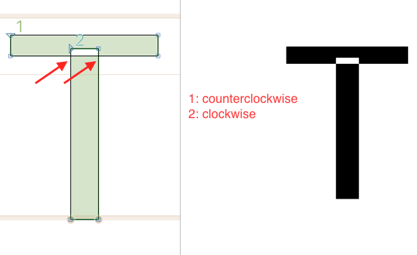
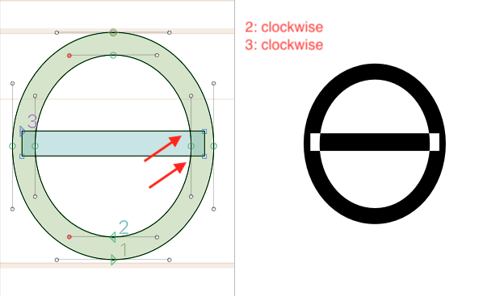
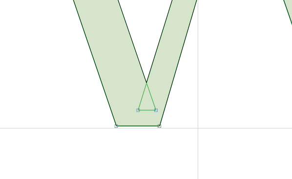

# Wrong Overlapping Path Detector

A [Glyphs.app](https://glyphsapp.com/) script to find the wrong direction whenever two shapes have intersections. 

It is commonly found when we use `Reconnect Nodes` to split one shape into two. The glyph will have blank intersections if the condition is unresolved.

Most problems can be solved by applying `Path > Correct Path Direction`, but a few cannot, that's why I read this script.

A Chinese version is contained below.

## How to Use

1. Open *Window > Macro Panel*
2. Paste the code.
3. Select the glyph you want to check.
4. Click Run.
5. Read the console log.

## Algorithm

This wrong overlapping can be found in two condition:

1. A clockwise path overlaps to a counterclockwise path.

2. Two clockwise paths have overlap.

In addition, we have to exclude self-open corners, which have intersection but no overlapping problem:

***

# Wrong Overlapping Path Detector

在 [Glyphs.app](https://glyphsapp.com/) 中，當我們透過 `Reconnect Nodes` 將一個路徑拆分成兩個的時候，有時候會出現路徑方向錯誤，致使字符在渲染後，出現空白交錯區的情況。

本腳本可以協助您挑出那些有問題的字符。

## 使用方法

1. 打開 *Window > Macro Panel*。
2. 貼上程式碼。
3. 選取要檢查的字符。
4. 按 Run。
5. 若發現有問題的字，在 console 中會顯示有問題的字符名稱。